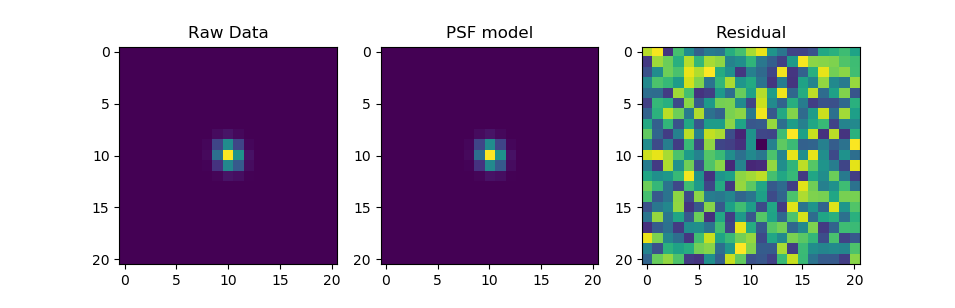

# PhotometryTools
Tools for performing aperture and PSF photometry for real time data analysis

## Features
- PSF Fitting (Gaussian, Lorentz, Pseudo-Voigt + Rotations!)
- Aperature Photometry (Fractional pixel values handled by estimating overlap of grid + circle)
- PSF Photometry (Integrate over weird PSFs) 
- Sky Background Subtraction (can handle fractional pixels within an annulus)
- Data Generator 

### Requirements
- Python 3.4+
- Numpy
- Matplotlib
- Scipy
- Photutils


### Example Code
```python
from PhotometryTools import ccd, psf, fit_psf, phot, estimate_sigma, mesh_box
import matplot.pyplot as plt
import numpy as np

if __name__ == "__main__":

    # simulate an image
    img = ccd([32,32])
    star = psf( [15.1,15.0, 1000,0.75,0.85, np.pi/6, 0], gaussian_psf)
    img.data += np.random.random( img.data.shape)
    img.draw(star)

    # compute flux weighted centroid on subarray
    xv,yv = mesh_box([15,15],5)
    wx = np.sum(np.unique(xv)*img.data[yv,xv].sum(0))/np.sum(img.data[yv,xv].sum(0))
    wy = np.sum(np.unique(yv)*img.data[yv,xv].sum(1))/np.sum(img.data[yv,xv].sum(1))

    # estimate standard deviation 
    x,y= img.data[yv,xv].sum(0),img.data[yv,xv].sum(1) 
    sx = estimate_sigma(x)
    sy = estimate_sigma(y)

    # fit PSF 
    pars = fit_psf(
        img.data,
        [wx, wy],
        [np.max(img.data[yv,xv]), sx, sy, 0, np.min(img.data[yv,xv]) ], # initial guess: [amp, sigx, sigy, rotation, bg]
        [wx-5, wy-5, 0,   0, 0, -np.pi/4, 0],                           # lower bound: [xc, yc, amp, sigx, sigy, rotation,  bg]
        [wx+5, wy+5, 1e5, 2, 2,  np.pi/4, np.percentile(img.data,25)],  # upper bound: 
        psf_function=gaussian_psf,
        box=5 # only fit a subregion +/- 5 px from centroid
    )

    area = phot(img.data, pars[0],pars[1],r=2.5,dr=8)
    print('best fit parameters:',pars)
    print('phot area=',area)
    print('psf area=',2*np.pi*pars[2]*pars[3]*pars[4])

    # compute PSF fit residual
    xv,yv = mesh_box([15,15], 10) # pull out subregion that was fit 
    model = psf( pars, gaussian_psf).eval(xv,yv)
    residual = img.data[yv,xv] - model 

    # diagnostic plots
    f,ax = plt.subplots(1,3)
    ax[0].imshow(img.data[yv,xv]); ax[0].set_title('Raw Data')
    ax[1].imshow(model); ax[1].set_title('PSF model')
    ax[2].imshow(residual); ax[2].set_title('Residual')
    plt.show()
```

Colors to scale in each image only


### Data Generator
```python 
    import numpy as np

    # simulate an image
    img = ccd([32,32])
    star = psf( [15.1,15.0, 1000,0.75,0.85, np.pi/6, 0], gaussian_psf)
    img.data += np.random.random( img.data.shape)
    img.draw(star)
```

If you want to make a fits file use the data generated above and add: 
```python 
from astropy.io import fits 
from datetime import datetime

# save to fits file
header = fits.Header( {'TIME':datetime.now().strftime("%H:%M:%S.%f")} )
hdu = fits.PrimaryHDU(img.data,header=header)
hdul = fits.HDUList([hdu])
hdul.writeto("test.fits")
```

